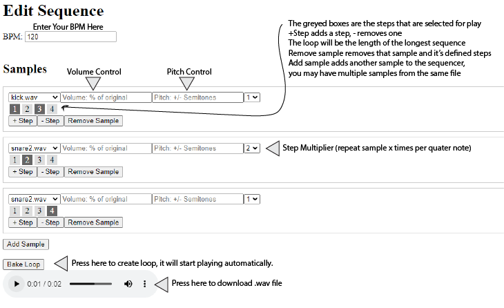

# PT-12 Rhythm
### A fully functional drumkit/sequencer with a webUI.
Teo Coffman

## Description:

This is a fully functional drumkit sequencer written in python that utilizes Flask to serve a web based interface for
laying down sequences and developing drum loops. The workflow is similar to other step sequencers, where samples are
played base on a user defined sequence of steps. There is user defined pitch and volume controls for each selected
sample in addition to a step multiplier, which allows a user to specify a sample to be played 1-8 times per quarter
note, psuedo-increasing the effective resolution of the step. Included are several samples that I recorded, however
any number of samples can be added by the user to the ./samples/ directory.

The program uses a behind the scenes csv file to record the user defined sequence and passes that on to python code
that directly interacts with wav file data and bakes the loop based on the sequence. The audio file is than served
to the user's web browser and played + available for direct download.

Each sample is played monophonically, with no effective limit on the number of voices (samples), or steps. The user
dynamically defines the length of the sequence by adding and removing steps, as well as the number of voices by adding
and removing samples to the sequencer. The user can define the volume level (in percentage of sample volume), as well as
pitch (plus or minus semitones).

## Usage and Build Requirements:

Requirements: python 3, scipy, numpy, librosa, setuptools, flask (pip install -r requirements.txt)

Build: python app.py and navigate to http://localhost:5000 in your web browser.

To add a sample simply place your .wav file in the ./samples directory (any sample rate and data format should be fine but I haven't tested all of them).

## Example Usage:

## Retrospective

I had initially set out to create a terminal based user interface, but I soon realized that this would be very difficult, as I didn't have any experience with curses or
other text based UI frameworks. I decided to pivot to a webUI, which ended up actually being better, as it is very easy to dynamically add fields based on user input, which
allows the sequencer to have as many steps as the user wants, with as many samples as they want, as well as providing a much more intuitive UI. Since I followed the professor's
advice to create a CSV reader that dictated the sequence first and than work on the UI, I used that code as a call in my Flask app along with a constructor based on the user's input.
I think I could consolidate this, without having to write to a CSV file. Additionally, I had to reformat the way I was processing samples to deal with a variety of sample rates and
data formats present in .wav files. I also had to rewrite some of the sample fill logic to account for the step multiplier logic, which allows a user to specify a sample to be played
n times per step. The challenge here was to make sure the sample didn't overlap with itself, which ended up improving the sequencer, as long samples can now be played out (till the end of the
loop at maximum). I would like to add the ability to save and load sequences as well as some basic effects to apply to either each sample or the master.

### License
This project is released under the MIT license, please see the [LICENSE](LICENSE.txt) file for details.